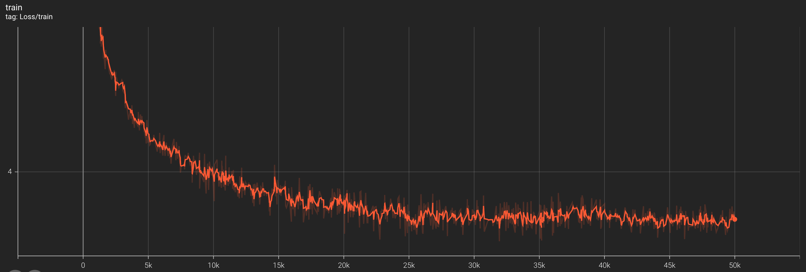
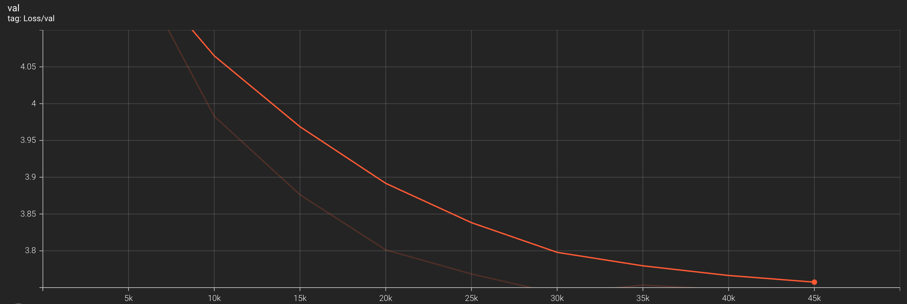
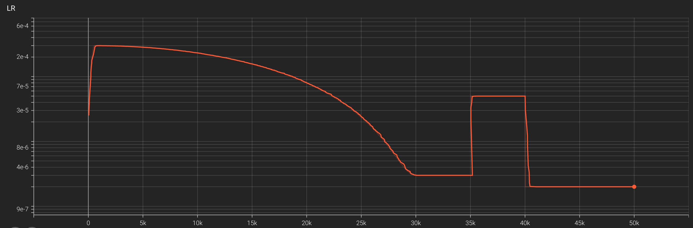

**The Transformer architecture We need to implement**

- This is my first time writing deep learning homework related to pytorch. 
I have only written traditional machine learning algorithms and theories
implemented in R language or numpy before, so I often get stuck when coding.

- My coding time frame is the same as the Stanford deadline.
Considering that they have a good foundation and the help of the
teaching assistant, it should not be a big problem to complete it
within the deadline. If you want to go into the details of all the
components you wrote, please set aside enough time (lol: at least a month)

- I learned a lot in this class. It was hard, but worth it.
Thanks again to Stanford University for its selfless dedication
to facilitating off-campus learners like you and me.

- Below is an image of my training parameters. My dataset is TinyStory.
I don’t have a good graphics card and I don’t rent one. I only have an Air M2 
(the temperature is too high and it stops at 2200 steps).
I started using traditional plots and later switched to TensorBoard to monitor losses.
(No careful tuning of hyperparameters, mostly from the default)

 
  

#### 2025.10.11
- Use Single RTX 4090
- torch.compile()
- torch(FlashAttention)
- DataSets: owt_train owt_valid
- Time: About 90mins
##### HyperParameters:
Model_HyperParameters Same as recommended in as1
Since I didn’t have much training experience before, the final loss fluctuated between 3.8~3.6, with a mean of about 3.7. I learned that loss is very important for LLM. Before I reduced the owt_train dataset to below 3.3, I will not use distributed parallel training.
Train_HyperParameters()
1. device: "cuda"
2. batch_size: 64 # 0~45000 ==> 64 45000~50000 ==> 128
3. num_epochs: 5
4. learning_rate: 0.0003 # 0~35000 ==> 0.0003 35000~40000 ==> 0.0005
5. max_iters: 50000
6. eval_interval: 200
7. warmup_steps: 500 # 0~35000 ==> 500 35000~40000 ==> 200
8. lr_decay_steps: 5000
9. min_lr: 3.0e-6 # 0~35000 ==> 3.0e-6 35000~40000 ==> 5.0e-5
10. gradient_clip_val: 1.0

