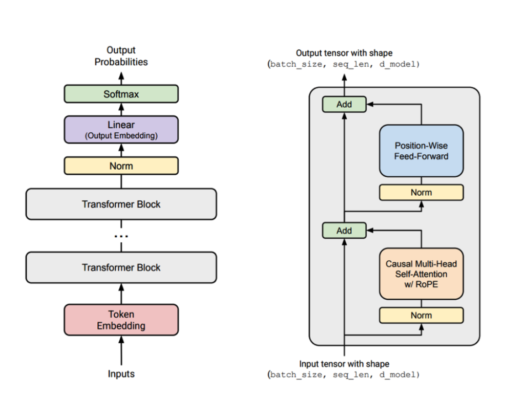
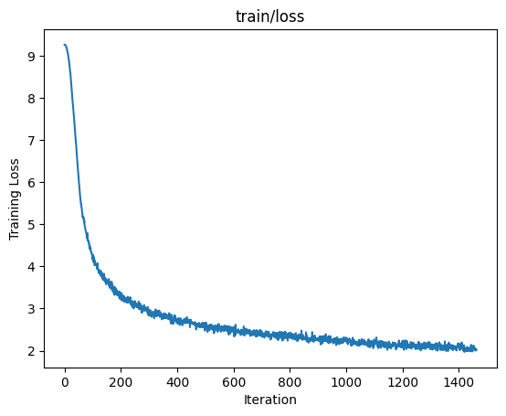
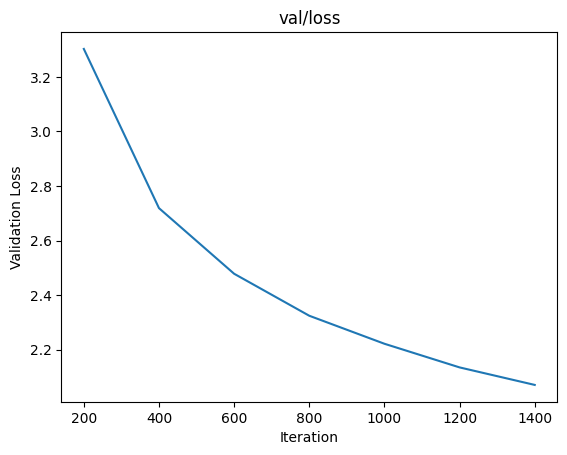
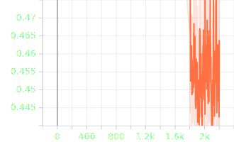
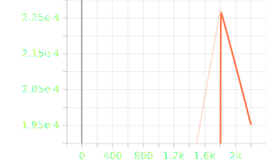
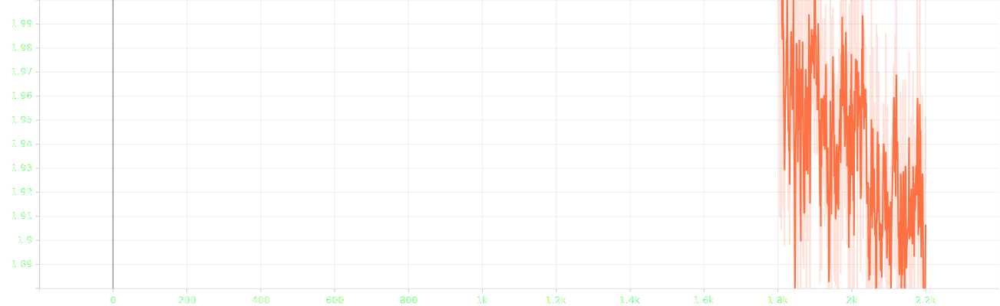

**The Transformer architecture We need to implement**

- This is my first time writing deep learning homework related to pytorch. 
I have only written traditional machine learning algorithms and theories
implemented in R language or numpy before, so I often get stuck when coding.

- My coding time frame is the same as the Stanford deadline.
Considering that they have a good foundation and the help of the
teaching assistant, it should not be a big problem to complete it
within the deadline. If you want to go into the details of all the
components you wrote, please set aside enough time (lol: at least a month)

- I learned a lot in this class. It was hard, but worth it.
Thanks again to Stanford University for its selfless dedication
to facilitating off-campus learners like you and me.

- Below is an image of my training parameters. My dataset is TinyStory.
I don’t have a good graphics card and I don’t rent one. I only have an Air M2 
(the temperature is too high and it stops at 2200 steps).
I started using traditional plots and later switched to TensorBoard to monitor losses.
(No careful tuning of hyperparameters, mostly from the default)

 
  
